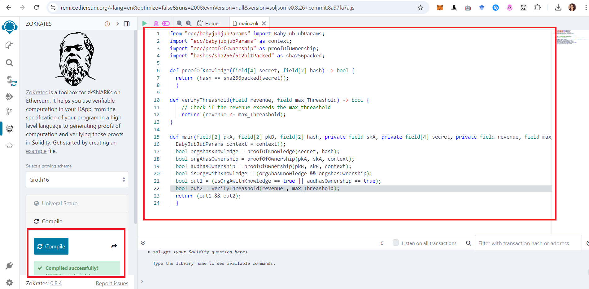

# Demo_TraSSI_ICSOC

To simplify the task for researchers in reproducing our TraSSI solution, we have chosen to rely on online tools that avoid the need for complex local installations.

- For ZoKrates, instead of requiring users to manually install and configure the system, we utilize the ZoKrates Plugin within the Ethereum Remix online IDE, offering a more convenient and seamless way to interact with the tool.
  
  https://remix.ethereum.org/
  
- For FHE computations, the Python scripts are available and ready to run directly through a Colab link, provided in a ".pynb" notebook format. This approach ensures easy execution and accessibility, significantly reducing installation barriers and streamlining the reproduction process for researchers.
  
  https://colab.research.google.com/drive/1HK18ven1k0utCf6WnSoBIxQOCo6usO4d


## Zokrates Plugin

We provide a step-by-step guide to assist you in compiling, setting up, exporting the verifier, computing the witness, and generating proofs.

For documentation on ZoKrates open the [link](https://zokrates.github.io/gettingstarted.html).

To begin:

1. Open the [Remix IDE](https://remix.ethereum.org/) in a browser window.

2. Navigate to the Plugin Manager and activate the following plugins:

- ZoKrates

- Solidity Compiler (already activated)

- Deploy & Run Transactions (already activated)

Once the plugins are activated, go to the ZoKrates plugin and click on the example hyperlink, accepting any necessary permissions.

This will prepare your environment for the subsequent tasks.


 


3. Compilation

``` bash
from "ecc/babyjubjubParams" import BabyJubJubParams;
import "ecc/babyjubjubParams" as context;
import "ecc/proofOfOwnership" as proofOfOwnership;
import "hashes/sha256/512bitPacked" as sha256packed;

def proofOfKnowledge(field[4] secret, field[2] hash) -> bool {
  return (hash == sha256packed(secret));
  }

def verifyThreashold(field revenue, field max_Threashold) -> bool {
    // Check if the revenue exceeds the max_threashold
    return (revenue <= max_Threashold);
}
  
def main(field[2] pkA, field[2] pkB, field[2] hash, private field skA, private field[4] secret, private field revenue, field max_Threashold, private field skB) -> bool {
  BabyJubJubParams context = context();
  bool orgAhasKnowledge = proofOfKnowledge(secret, hash);
  bool orgAhasOwnership = proofOfOwnership(pkA, skA, context);
  bool audhasOwnership = proofOfOwnership(pkB, skB, context);
  bool isOrgAwithKnowledge = (orgAhasKnowledge && orgAhasOwnership);
  bool out1 = (isOrgAwithKnowledge == true || audhasOwnership == true);
  bool out2 = verifyThreashold(revenue , max_Threashold);
  return (out1 && out2);
  }
```

To compile our program, click on the "Compile" button.

If the process completes without errors, a message indicating successful compilation will be displayed.




4. Setup

The next step is to perform the setup. Click on "Setup" to expand the section, then select "Run Setup."

If the setup is successful, a confirmation message will appear. You can download the proving and verifying keys by clicking the "Download Keys" button.
