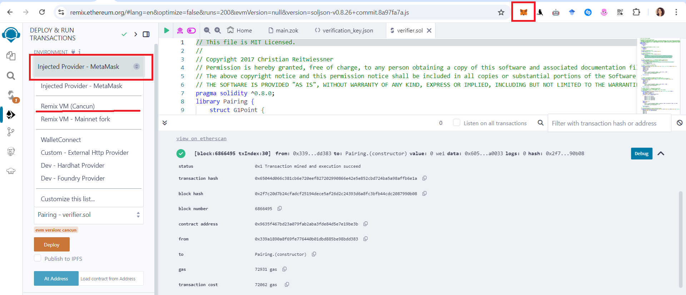

# Demo_TraSSI_ICSOC

To simplify the task for researchers in reproducing our TraSSI solution, we have chosen to rely on online tools that avoid the need for complex local installations.

- For ZoKrates, instead of requiring users to manually install and configure the system, we utilize the ZoKrates Plugin within the Ethereum Remix online IDE, offering a more convenient and seamless way to interact with the tool.
  
  https://remix.ethereum.org/
  
- For FHE computations, the Python scripts are available and ready to run directly through a Colab link, provided in a ".pynb" notebook format. This approach ensures easy execution and accessibility, significantly reducing installation barriers and streamlining the reproduction process for researchers.
  
  https://colab.research.google.com/drive/1HK18ven1k0utCf6WnSoBIxQOCo6usO4d


## Step1: ZKP-based Verifiable Computations (Part1)

We provide a step-by-step guide to assist you in compiling, setting up, exporting the verifier, computing the witness, and generating proofs.

For documentation on ZoKrates open the [link](https://zokrates.github.io/gettingstarted.html).

### 1. Install the Zokrates Plugin

Open the [Remix IDE](https://remix.ethereum.org/) in a browser window.

Navigate to the Plugin Manager and activate the following plugins:

- ZoKrates

- Solidity Compiler (already activated)

- Deploy & Run Transactions (already activated)

Once the plugins are activated, go to the ZoKrates plugin and click on the example hyperlink, accepting any necessary permissions.

This will prepare your environment for the subsequent tasks.


 


### 2. Compile

To proceed, copy the entire program code from the designated source.

``` python
from "ecc/babyjubjubParams" import BabyJubJubParams;
import "ecc/babyjubjubParams" as context;
import "ecc/proofOfOwnership" as proofOfOwnership;
import "hashes/sha256/512bitPacked" as sha256packed;

def proofOfKnowledge(field[4] secret, field[2] hash) -> bool {
  return (hash == sha256packed(secret));
  }

def verifyThreashold(field revenue, field max_Threashold) -> bool {
    // Check if the revenue exceeds the max_threashold
    return (revenue <= max_Threashold);
}
  
def main(field[2] pkA, field[2] pkB, field[2] hash, private field skA, private field[4] secret, private field revenue, field max_Threashold, private field skB) -> bool {
  BabyJubJubParams context = context();
  bool orgAhasKnowledge = proofOfKnowledge(secret, hash);
  bool orgAhasOwnership = proofOfOwnership(pkA, skA, context);
  bool audhasOwnership = proofOfOwnership(pkB, skB, context);
  bool isOrgAwithKnowledge = (orgAhasKnowledge && orgAhasOwnership);
  bool out1 = (isOrgAwithKnowledge == true || audhasOwnership == true);
  bool out2 = verifyThreashold(revenue , max_Threashold);
  return (out1 && out2);
  }
```

To compile our program, click on the "Compile" button.

If the process completes without errors, a message indicating successful compilation will be displayed.


### 3. Setup

The next step is to perform the setup. Click on "Setup" to expand the section, then select "Run Setup."

If the setup is successful, a confirmation message will appear. You can download the proving and verifying keys by clicking the "Download Keys" button.


### 4. Export Verifier

We move to the Export Verifier step.

If the export is successful, you will have the option to either open the generated verifier directly in the Remix Editor or download it. By selecting the "Open in Remix Editor" option, the plugin will automatically create and open the "verifier.sol" file within the Remix Editor. 

Instructions for compiling and deploying the Verifier smart contract are provided further on.


### 5.Compile and Deploy "Verifier.sol"

To compile and deploy the "Verifier.sol" contract, begin by navigating to the Solidity Compiler plugin and selecting "Compile" "Verifier.sol."

Once the compilation is complete, switch to the "Deploy & Run Transactions" plugin. From the dropdown menu, select "Verifier — browser/verifier.sol" and click "Deploy." You can choose to deploy the contract on the JavaScript VM (Remix VM) or any testnet or mainnet. Please note that these contracts are large and may consume significant gas fees.

If you select the JavaScript VM (Remix VM), you do not need to use MetaMask. However, if you choose to deploy on a testnet like Sepolia, you will need to use MetaMask, as illustrated in the figure below.
(You can simply use JavaScript VM (Remix VM)).





After deploying the verifier, we will proceed to the "Compute Witness" and "Generate Proof" steps in ZoKrates. However, before we can compute the witness, we need to obtain the necessary "inputs" from the FHE calculations. Therefore, the next step is to run the Python code for the FHE computations first.


## Step2: FHE-based Computations on Encrypted Data (Part1)

The FHE computations are provided in this Colab notebook, accessible via the following [link](https://colab.research.google.com/drive/1HK18ven1k0utCf6WnSoBIxQOCo6usO4d). This allows anyone to directly test and execute the code without the need for local installations. The notebook is fully set up, enabling researchers to run the computations with ease and explore the functionality of the homomorphic encryption techniques used in our solution.

Link: https://colab.research.google.com/drive/1HK18ven1k0utCf6WnSoBIxQOCo6usO4d

### Install the required Python libraries by running the following commands:

These libraries are essential for enabling ZoKrates cryptographic functions (zokrates_pycrypto), performing homomorphic encryption operations (tenseal), and interacting with the Ethereum blockchain (web3).

``` bash
pip install zokrates_pycrypto
pip install tenseal
pip install web3
```

### Execute the following code:

``` python
import tenseal as ts
import hashlib
from zokrates_pycrypto.eddsa import PrivateKey, PublicKey
from zokrates_pycrypto.field import FQ
from zokrates_pycrypto.utils import write_signature_for_zokrates_cli

if __name__ == "__main__":

    # Setup TenSEAL context
    context = ts.context(
            ts.SCHEME_TYPE.CKKS,
            poly_modulus_degree=8192,
            coeff_mod_bit_sizes=[60, 40, 40, 60]
          )
    context.generate_galois_keys()
    context.global_scale = 2**40

    # Encrypt the number of units sold
    num_units = [100]
    encrypted_num_units = ts.ckks_vector(context, num_units)

    # Encrypt the price per unit
    price_per_unit = [50]
    encrypted_price_per_unit = ts.ckks_vector(context,price_per_unit)

    # Compute the total revenue
    encrypted_revenue = encrypted_num_units * encrypted_price_per_unit

    # Setup maximum threshold
    max_threshold = "7000"


    # Write witness arguments to disk / Serialize the decrypted result and max_threshold for ZoKrates input
    #path = "zokrates_inputs.txt"
    #witness = "" + encrypted_revenue.decrypt()[0] + " " + max_threshold
    #witness = str(round(encrypted_revenue.decrypt()[0])) + " " + max_threshold
    #with open(path, "w+") as f:
        #f.write("".join(witness))

    print(str(round(encrypted_revenue.decrypt()[0])) + " " + max_threshold)

```


## Step3: ZKP-based Verifiable Computations (Part2)

Now that we have obtained the necessary inputs from the FHE program, we can proceed with computing the witness in ZoKrates.

### Compute Witness

To compute the witness, you will be prompted to provide input parameters. After entering the required values, click the "Compute" button to generate the witness.

If the operation completes successfully, a confirmation message will be displayed. You can view the witness by opening it in the Remix Editor or download it for further use.

Inputs:

```
pkA: ["14897476871502190904409029696666322856887678969656209656241038339251270171395","16668832459046858928951622951481252834155254151733002984053501254009901876174"]

pkB: ["14897476871502190904409029696666322856887678969656209656241038339251270171395","16668832459046858928951622951481252834155254151733002984053501254009901876174"]

hash: ["66887177014510045729599711290250768514642621566450030829962492932967577128470","2672298032000151429627794792737979639400309965406749841034588150477310325429"]

skA: 1997011358982923168928344992199991480689546837621580239342656433234255379025

secret: ["1","2","3","4"]

revenue: 5000

max_Threashold: 7000

skB: 1997011358982923168928344992199991480689546837621580239342656433234255379025
```


### Generate Proof

Click on "Generate." The output, as displayed below, should appear.

You have the options to copy the output, open it in the Remix Editor, or download it for further use.


### Verify

To validate the proof, navigate to the "Deploy & Run Transactions" plugin, paste the Remix-compatible parameters into the verifyTx field, and click the "transact" button.

Once the transaction is completed, expand the logs and review the decoded output. If successful, you should see the result: "0": "bool: r true", indicating that the transaction has been successfully verified.

inputs (in my case):

```
proof:
[["0x100f24115e5bf671cf48fedd290dff306d8c474d0f27ec19003db82c99fb60b0","0x1eb81f8d3b71a2c47f39533cb63928b74e2e3fd6c8bef5caf446e9f47e5b5b1f"],[["0x1e54b328e03a9d1e571633bbba06d404cdb5296740c07cede3cbe5fbe71a3bb9","0x199693022ba8e2a241cae869109c9d74a922446d75e407126d08f2dbeb177570"],["0x156ce59157362e27f7044732c4465d500136cdbd6af8ae3f473a2182f079f5d3","0x1af3d01354aa35a11d2c187db2b3aa483627c64d266155dceccdbc029f917b69"]],["0x16fdcfc8f8f782101ecfaf1b08d2c9081248bee1f69574a0ab870f09ecb14318","0x282d342f8e2410487b793bc285d74c2963f1f5d2c7eebd789f53a9310c0df065"]]

input:
["0x20efac506a3d21dc3882103a7a727ad821f2422988783ee8b2f1762ecd0dbb03","0x24da398ed1996eae6dafb3a687806e3a49c3add6949774d6017b30a66b2503ce","0x20efac506a3d21dc3882103a7a727ad821f2422988783ee8b2f1762ecd0dbb03","0x24da398ed1996eae6dafb3a687806e3a49c3add6949774d6017b30a66b2503ce","0x02b3e19b345383d0cea34e380ad1753eb50091bd615826a68957c5416e6b8e13","0x05e87792f7b7d073415d94509d1ce9f991248acc30ffa78fb0e354100676f2b5","0x0000000000000000000000000000000000000000000000000000000000001b58","0x0000000000000000000000000000000000000000000000000000000000000001"]

```


## Step4: FHE-based Computations on Encrypted Data (Part2)

We now move on to verifying the verifyTx function, not from the Remix IDE, but directly from the Python program. You can execute this verification through the provided Colab notebook, using the address of the contract that has been deployed on the Sepolia testnet. There's no need to modify the program; simply run the notebook as is, and it will interact with the deployed contract.

(The contract has been deployed by me, and its address can be used by anyone to verify the transaction. This allows for open and transparent validation of the contract's functionality.)

Link:   https://colab.research.google.com/drive/1HK18ven1k0utCf6WnSoBIxQOCo6usO4d


